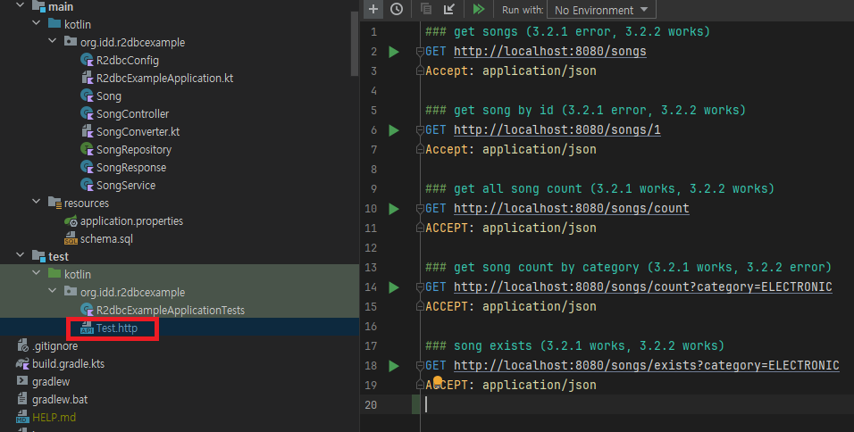

# r2dbc-error-example
example code for compare errors in spring-data-r2dbc 3.2.1 and 3.2.2 

## Summary

Count query method except 'repository default' works in 3.1.1, but throws error in 3.2.2. Maybe bug?

## Situation

While using Reading Converter for converting data, I found some query method which works in 3.2.1 but throws error in 3.2.2.

You can compare 3.2.1 and 3.2.2 in this example code.

## Error Description

Codes added at `R2dbcEntityTemplate.java` in 3.2.2 handle 'count query method' differently compared to 3.2.1.

You can see changes below or [Comparing changes](https://github.com/spring-projects/spring-data-relational/compare/3.2.1...3.2.2)

```java
// 3.2.1
if(simpleType) {
    rowMapper = dataAccessStrategy.getRowMapper(resultType);
} else {
... // else logic
}

// 3.2.2
if(converter instanceof AbstractRelationalConverter relationalConverter
    && relationalConverter.getConversions().hasCustomReadTarget(Row.class,  entityType)) {

    ConversionService conversionService = relationalConverter.getConversionService();
    rowMapper = (row, rowMetadata) -> (T) conversionService.convert(row, entityType);
} else if(simpleType) {
    rowMapper = dataAccessStrategy.getRowMapper(resultType);
} else {
... // same as 3.2.1
}
```

We have `countByCategory(category: Category): Long` for example.

In 3.2.1, `R2dbcEntityTemplate` checks whether return type is simple type or not at first. So query result doesn't enter ReadingConverter.

In 3.2.2 however, it checks whether custom converter exists or not before checking simple type. In this time, query result enters ReadingConverter. Query result have only one column, and error occurs.

## How to test

1. set version of `org.springframework.boot` to 3.2.1 or 3.2.2 in build.gradle and reload
2. run `R2dbcErrorExampleApplication`
3. run each http request at Test.http


## Suggestion

I think switching first and second statement may solve this problem.
```java
if(simpleType) {
    rowMapper = dataAccessStrategy.getRowMapper(resultType);
} else if(converter instanceof AbstractRelationalConverter relationalConverter
    && relationalConverter.getConversions().hasCustomReadTarget(Row.class, entityType)) {

    ConversionService conversionService = relationalConverter.getConversionService();
    rowMapper = (row, rowMetadata) -> (T) conversionService.convert(row, entityType);
} else {
... // same as 3.2.1
}
```

## ETC

Sorry for my poor English. I hope you understand what I want to say.